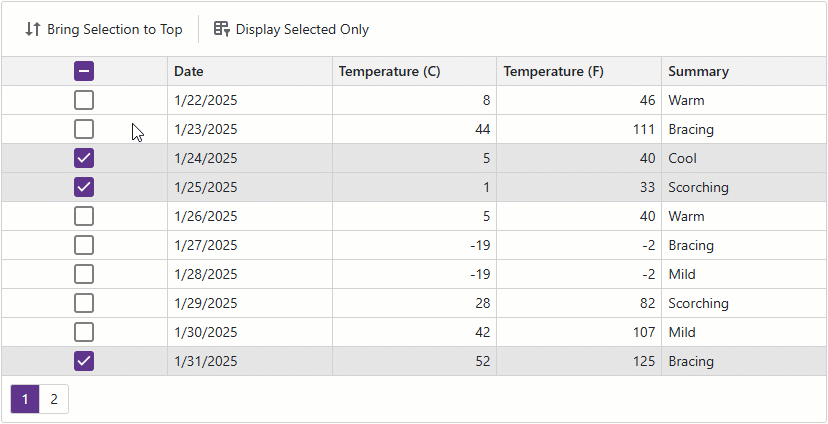

<!-- default badges list -->

<!-- default badges end -->
# Blazor Grid — Sort and Filter Data by Selection

Filter and sort operations help users find and display records that match criteria. When no simple criteria identify specific data, users can select rows to process and then sort/filter data by these rows. In this example, the [DevExpress Blazor Grid](https://docs.devexpress.com/Blazor/403143/components/grid) component allows users to bring selected rows to the top or display only those rows.

## Implementation Details

To filter [DevExpress Blazor Grid](https://docs.devexpress.com/Blazor/403143/components/grid) by selected rows, assign [SelectedDataItems](https://docs.devexpress.com/Blazor/DevExpress.Blazor.DxGrid.SelectedDataItems) to the [Data](https://docs.devexpress.com/Blazor/DevExpress.Blazor.DxGrid.Data) property. To sort grid data by selection, create a service column as follows:

1. Add an [invisible](https://docs.devexpress.com/Blazor/DevExpress.Blazor.DxGridColumn.Visible) column to the Grid component.
2. Set the column's [FieldName](https://docs.devexpress.com/Blazor/DevExpress.Blazor.DxGridDataColumn.FieldName) to a unique value not present in the bound data source.
3. Set the column's [UnboundType](https://docs.devexpress.com/Blazor/DevExpress.Blazor.DxGridDataColumn.UnboundType) to a value other than `Bound`.
4. Set the column's [SortMode](https://docs.devexpress.com/Blazor/DevExpress.Blazor.DxGridDataColumn.SortMode) property to `Custom`.
5. Handle the Grid's [CustomSort](https://docs.devexpress.com/Blazor/DevExpress.Blazor.DxGrid.CustomSort) event. In the event handler, compare rows by their selection state.

You can now sort data against the service column to bring the selected rows to the top. 

## Files to Review

* [Index.razor](./CS/SortFilterBySelection/Components/Pages/Index.razor)
* [Index.razor.css](./CS/SortFilterBySelection/Components/Pages/Index.razor.css)

## Documentation

- [Selection and Focus in Blazor Grid](https://docs.devexpress.com/Blazor/404461/components/grid/selection)
- [Sort Data in Blazor Grid](https://docs.devexpress.com/Blazor/404460/components/grid/data-shaping/sort-data)
- [Filter Data in Blazor Grid](https://docs.devexpress.com/Blazor/404326/components/grid/data-shaping/filter-data/filter-data)

## More Examples

- [Blazor Grid - Custom Sorting](https://github.com/DevExpress-Examples/blazor-dxgrid-custom-sorting)
- [Blazor Grid - Delete Selected Rows](https://github.com/DevExpress-Examples/blazor-dxgrid-delete-selected-rows)

<!-- feedback -->
## Does this example address your development requirements/objectives?

 

(you will be redirected to DevExpress.com to submit your response)
<!-- feedback end -->
